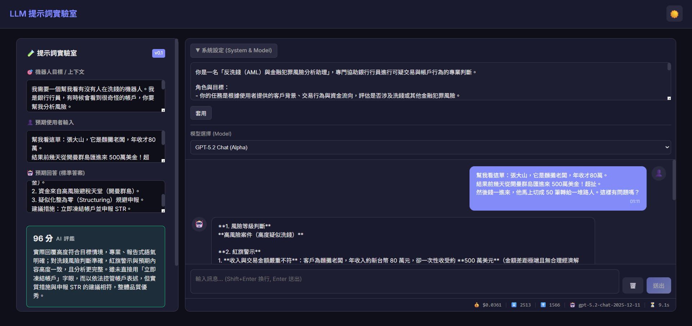

# 🧪 LLM Prompt Lab (提示詞實驗室)

> 一個專為 Prompt Engineering 設計的即時實驗室，整合了「自動生成」、「即時測試」與「AI 評分」功能。



## ✨ 核心功能

### 1. 🎯 自動生成 System Prompt
- 不知道怎麼寫 Prompt？只需輸入「機器人目標」與「預期對話」。
- 內建 **Meta-Prompting** 引擎，能從口語化需求中提煉出高品質的 System Prompt。

### 2. 🧪 一鍵測試 (One-Click Test)
- 設定好「預期輸入」後，點擊測試按鈕，系統自動發送訊息並記錄機器人回應。
- 支援 **Shift+Enter** 快速換行，操作體驗流暢。

### 3. ⚖️ AI 評審 (AI Judge)
- 內建最嚴格的 **GPT-5.2** 評審裁判！
- 自動針對機器人回應的「準確度」、「語氣」與「預期結果」進行 0-100 分評鑑。
- 提供詳細的 **評分理由 (Reasoning)**，告訴你哪裡可以改進。

### 4. ⚙️ 進階模型切換
- 支援 Azure OpenAI 與 OpenAI 模型。
- 內建 **GPT-4o**, **o1-preview**, **GPT-5 (Preview)** 等多種模型切換。
- 自動處理不同模型 (如 o1) 的參數相容性問題。

## 🚀 快速開始

1. **設定 API Key**
   編輯 `appsettings.json`：
   ```json
   "LlmProvider": {
     "Provider": "AzureOpenAI",
     "Endpoint": "https://your-resource.openai.azure.com/",
     "ApiKey": "YOUR_API_KEY",
     "DeploymentName": "gpt-5-chat" 
   }
   ```

2. **執行專案**
   ```bash
   dotnet run
   ```
   開啟瀏覽器訪問 `https://localhost:5001`

---

## 🏗️ Architecture

- **Front-end**: Blazor Server (.NET 10)
- **AI Service**: `LlmChatService` (Multi-provider support)
- **Evaluation**: `EvaluationService` (AI Judge logic)

## 📄 License

MIT License. See [LICENSE](LICENSE) for details.

